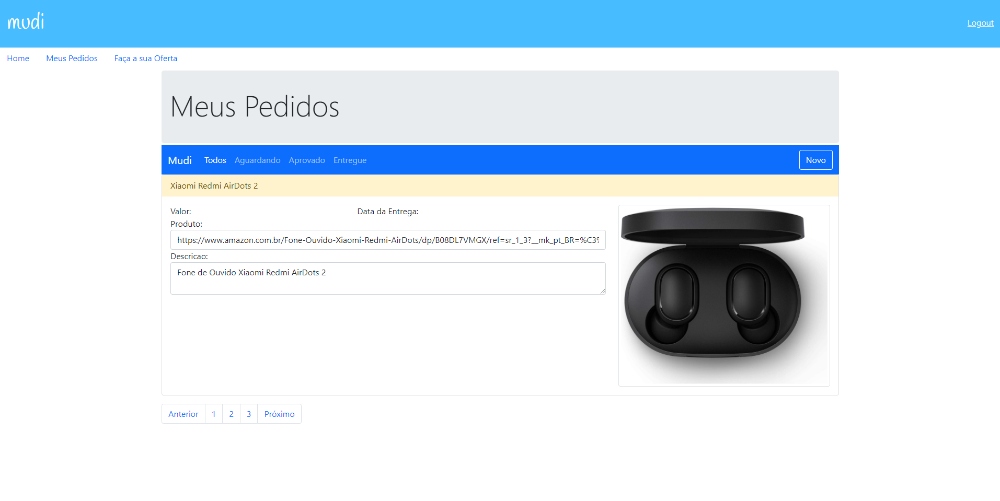

# Mudi
> O que é o Mudi?

> Mudi é uma aplicação Spring MVC e Spring Security criada para prática de desenvolvimento destes Frameworks.

Tecnologias Utilizadas: 
  * Spring MVC
  * Thymeleaf e Bootstrap
  * Spring Data
  * Spring Security
  * Ajax
  * Vue.js
  * API REST com Spring Boot
  
  Tela Inicial:
  
 
  
